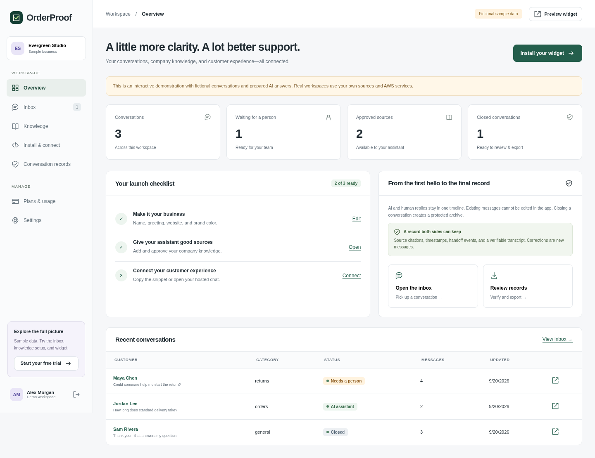
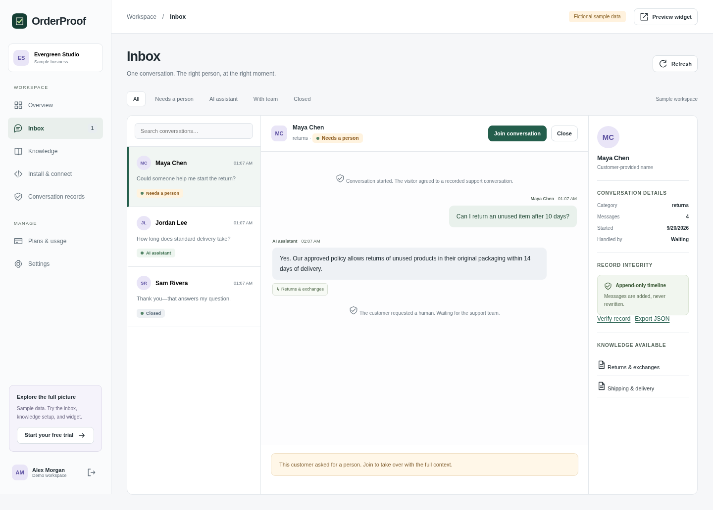
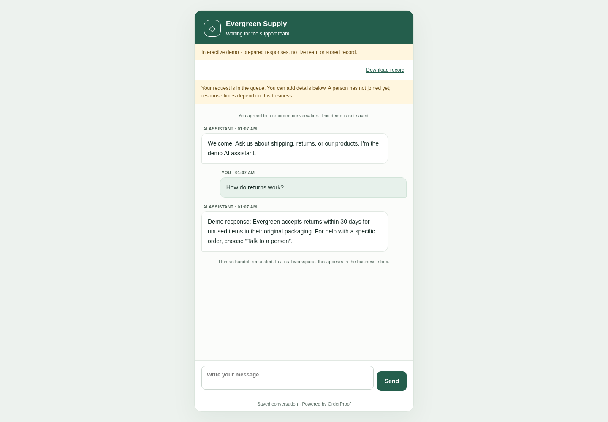
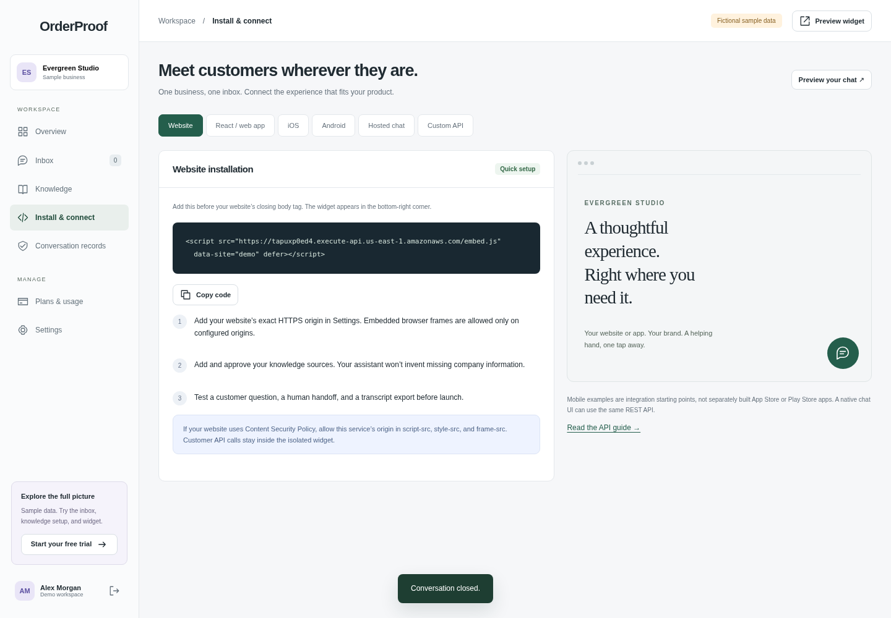
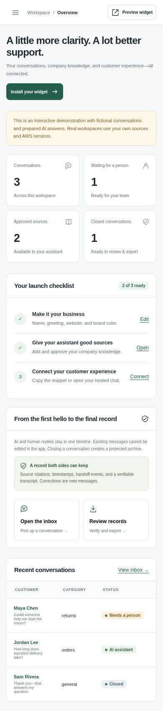
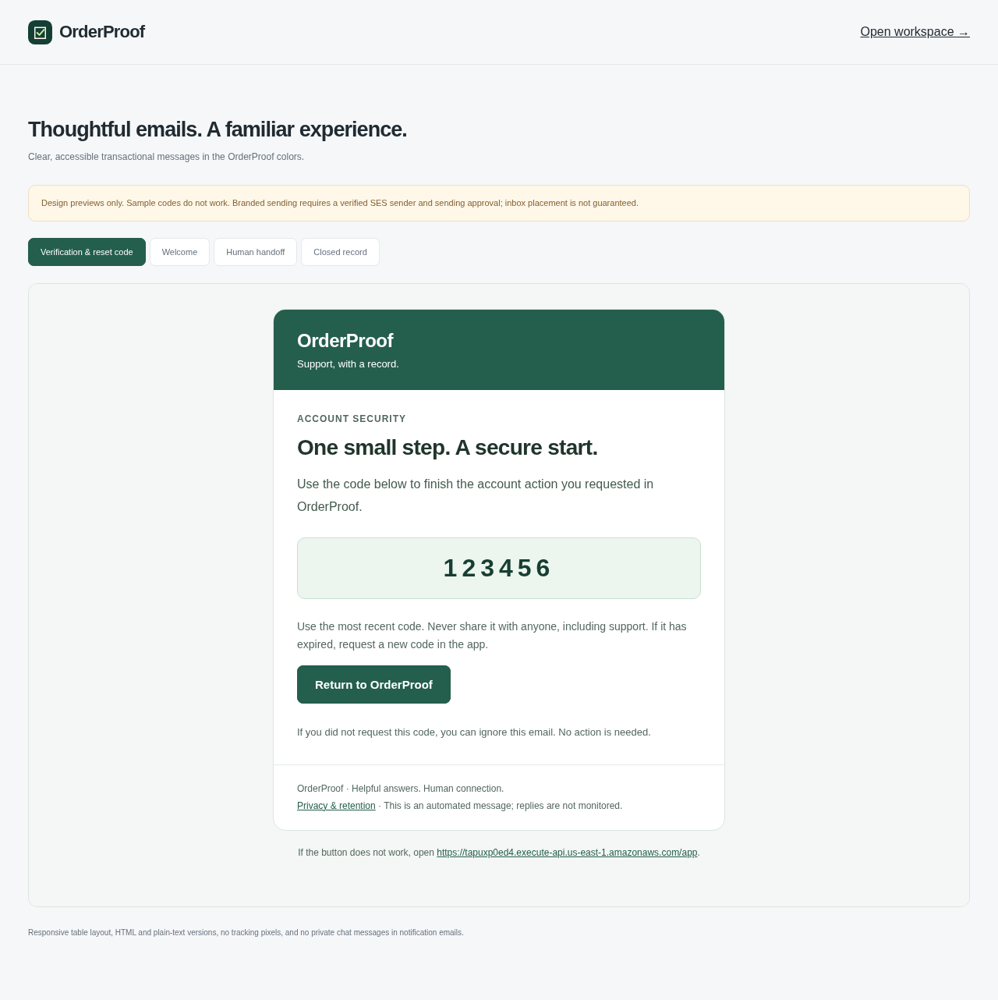

# OrderProof

**Helpful answers. Human connection. Nothing lost.**

Embeddable customer support that answers from approved company knowledge, connects customers with a person, and preserves the complete conversation for later reference.

[Live application](https://tapuxp0ed4.execute-api.us-east-1.amazonaws.com) · [Website integration demo](https://tapuxp0ed4.execute-api.us-east-1.amazonaws.com/integration-demo) · [Email design preview](https://tapuxp0ed4.execute-api.us-east-1.amazonaws.com/email-preview) · [Audit report](docs/final-audit.md)

> **Release status: deployed pilot; production release blocked.** AWS storage, authentication, human handoff, and transcript verification passed the recorded live audit. Bedrock generation is blocked by this AWS account’s token quota, so the application offers human support instead. Branded email templates are implemented, but a verified sender domain and SES production access remain outstanding. Stripe is intentionally deferred. See the [release gates](docs/final-audit.md).


*Screenshots show the deployed interface with clearly labeled fictional demonstration data. They are not evidence of successful live AI generation.*

## What it does

| Capability | Implementation |
| --- | --- |
| Company knowledge | Approve text, PDF, and public website content for retrieval. |
| Grounded assistance | Retrieve relevant passages and request structured answers with validated source references through Amazon Bedrock. |
| Human handoff | Move a conversation into the owner’s inbox, reply, and close it. |
| Preserved records | Append-only application events, a hash chain, and a versioned S3 archive with checksum verification. |
| Website installation | Bottom-right widget, React integration example, hosted chat, and customer API. |
| Mobile integration | iOS and Android WebView examples; native apps are not included or device-tested. |
| Business workspace | Knowledge management, inbox, records, installation settings, usage, and plan preferences. |
| Trial and plans | Server-enforced seven-day trial. Proposed $19 / $49 / $99 monthly plans; no charges or paid activation yet. |
| Transactional email | Green-and-white HTML and plain-text templates for verification, reset, welcome, handoff, and closure. Sender setup is pending. |

One owner operates each workspace’s human inbox. Voice calling and multi-agent staff roles are not implemented.

## Product walkthrough

1. Create a business workspace and approve its support knowledge.
2. Configure allowed website origins and install the widget.
3. A customer consents to recording and starts a conversation.
4. The service retrieves relevant company passages for the model. If generation is unavailable, it says so and offers human support.
5. The owner joins the conversation and replies in the same thread.
6. Closing the conversation creates a verifiable archive; the customer can export the transcript.





<details>
<summary>Customer chat, installation, and mobile screenshots</summary>







</details>

## Branded email experience

The email gallery uses the same green palette as the product, with responsive HTML and plain-text alternatives. These are design previews; the custom sender is not yet enabled.



## Architecture


[Full-size SVG](docs/assets/architecture.svg) · [Diagram source](docs/architecture.dot) · [Architecture details](docs/architecture.md)

The application uses API Gateway, Python Lambda, Cognito, DynamoDB, and private S3 storage. The responsive frontend uses HTML, CSS, and JavaScript. AWS SAM defines the infrastructure.

Retrieval is a bounded lexical search over approved company passages, with common word variants. It is intended for small knowledge collections; it is not a vector database or a managed Bedrock Knowledge Base. Bedrock Nova Lite is accessed through the Lambda IAM role, without browser-exposed model keys. Retrieved source identifiers are checked before an answer is accepted. Live answer quality still needs evaluation once the account’s quota is restored.

## Security and record integrity

- Cognito authentication protects owner operations; tenant and customer-token checks isolate conversations.
- The application’s event permissions omit update and delete operations. A hash chain detects changes to recorded events.
- Closed transcripts use versioned S3 objects with checksums and 30-day **governance-mode** retention. Authorized AWS administrators can bypass governance retention; this is not an absolute immutability or legal certification claim.
- Conversation events have a 90-day TTL from their start. Archives expire 90 days after closure; lifecycle deletion and DynamoDB TTL removal are asynchronous.
- Website imports restrict outbound destinations to reduce SSRF risk. Knowledge must be approved before retrieval.
- Email notifications exclude chat contents and customer access tokens. Sending is disabled until configured, with application-level limits and deduplication.

Read the [operations guide](docs/billing-and-operations.md) and [email delivery guide](docs/email-delivery.md) before enabling customer traffic.

## Run locally

Use Python 3.13, Node.js 24, and Chromium or Playwright’s bundled browser.

```sh
python3 -m venv .venv
.venv/bin/pip install -r requirements-dev.txt -r backend/requirements.txt
npm ci
npx playwright install chromium
python3 scripts/serve.py
```

Open `http://127.0.0.1:8080` and choose **Explore the demo**. This static preview uses fictional data; it does not emulate the AWS backend. Keep the preview running while executing browser tests in another terminal.

## Testing

```sh
.venv/bin/python -m pytest tests -q
.venv/bin/cfn-lint template.yaml
.venv/bin/python scripts/validate_security.py
npm run check:js
npm run test:support
npm run test:auth-email
npm run test:browser
```

Browser tests use `/usr/bin/chromium` when present, otherwise the bundled Playwright browser. Set `PLAYWRIGHT_CHROMIUM_EXECUTABLE` to override it. `ORDERPROOF_URL` selects an alternative deployment for browser checks.

The recorded audit includes **47 passing Python tests**, browser journeys and automated accessibility checks, infrastructure validation, and a synthetic live AWS workflow. Authentication browser tests mock Cognito responses; they do not prove mailbox delivery. Automated accessibility checks do not constitute a full accessibility certification.

[`scripts/smoke_support.py`](scripts/smoke_support.py) performs authenticated AWS integration checks, creates temporary test identities and synthetic records, and removes the identities afterward. Retained synthetic archives follow the configured lifecycle. Run it only against an AWS environment you are authorized to test.

The [GitHub Actions workflow](.github/workflows/ci.yml) runs local checks without AWS credentials or deployment permissions. It is prepared for publication; a successful GitHub-hosted run is not yet recorded.

## Deploy on AWS

Install the AWS CLI and AWS SAM CLI, then authenticate to your own AWS account. The first deployment can use:

```sh
sam build --template-file template.yaml
sam deploy --guided
```

Use the resulting public API URL for the `AppOrigin` parameter in your deployment configuration. Leave `EmailIdentityArn` and `EmailFrom` empty until sender verification is complete; configure both together when enabling SES. See [email setup](docs/email-delivery.md) for the required domain and delivery checks.

The existing pilot runs in `us-east-1`. Bedrock availability and quota must be checked for the model region configured in the template. Deploying infrastructure does not by itself make model access available.

Stripe is not required to run the pilot. Plan selection records a preference only. Paid subscriptions need a later implementation with verified webhook handling, subscription lifecycle controls, and billing tests before activation.

## Cost expectations

The [low-traffic estimate](docs/evidence/cost-estimate.json) is **$2.56/month**, with a **$5 planning allowance** against the requested $10 budget. Assumptions include 100,000 HTTP requests and 500 model calls per month. Application limits constrain modeled usage, but this estimate is **not a hard AWS spending cap**. Actual traffic, pricing, taxes, and unrelated resources can change the bill.

## Repository map

```text
backend/                 Lambda handlers, retrieval, records, email, and frontend
scripts/                 Preview server, validation, model evaluation, live smoke test
tests/                   Python and Playwright tests
docs/                    Architecture, integration, operations, and release evidence
.github/workflows/       Local-test CI; no automatic AWS deployment
template.yaml            AWS SAM infrastructure
```

## Documentation

- [Final audit and production release gates](docs/final-audit.md)
- [Product scope](docs/product-v2.md)
- [Integration and API guide](docs/integrations.md)
- [Branded email and deliverability](docs/email-delivery.md)
- [Billing, limits, and operations](docs/billing-and-operations.md)
- [Live AWS test evidence](docs/evidence/live-support-smoke.json)
- [Hackathon submission checklist](docs/submission.md)
- [AWS agent connection evidence](docs/evidence/aws-connection.md)
- [Recommended GitHub repository settings](docs/repository-settings.json)

## License

A license has not yet been selected. No open-source license is implied by this repository.
# orderproof-ai
