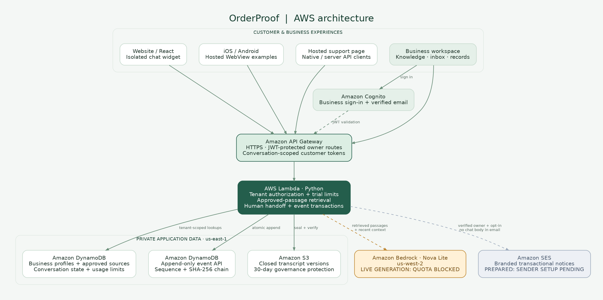
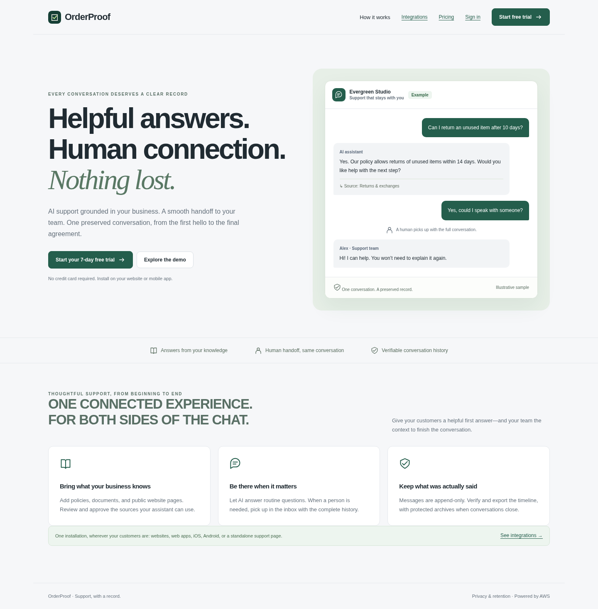
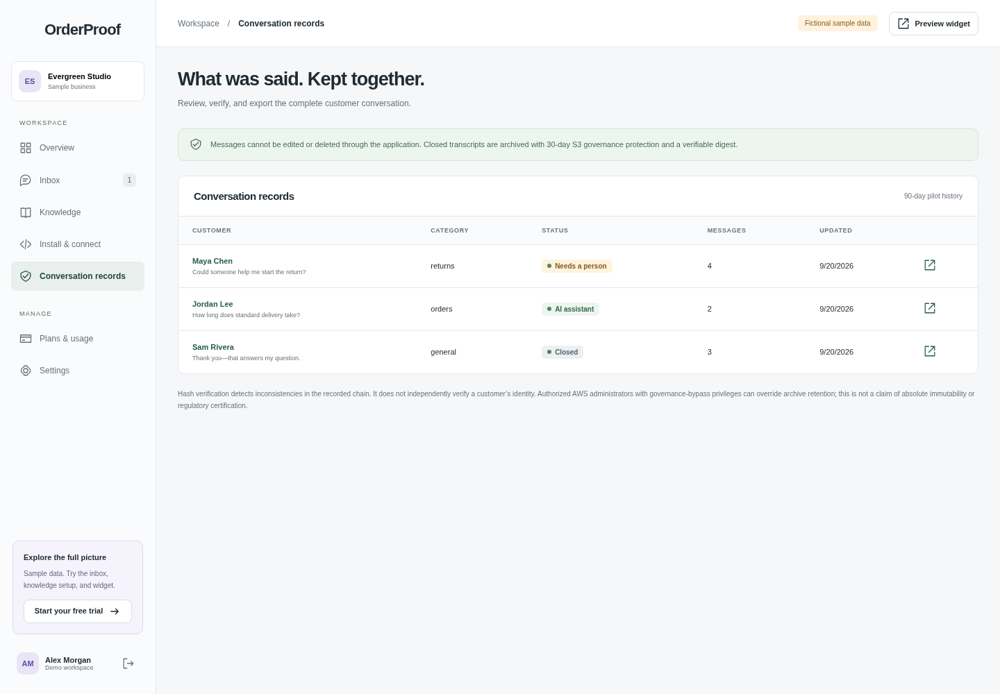

# OrderProof

**Helpful answers. Human connection. A record both sides can keep.**

OrderProof brings company-grounded support, human handoff, and verifiable conversation records into one embeddable experience for small businesses.

[Live application](https://tapuxp0ed4.execute-api.us-east-1.amazonaws.com) · [Integration demo](https://tapuxp0ed4.execute-api.us-east-1.amazonaws.com/integration-demo) · [Submission checklist](docs/submission.md) · [Release audit](docs/final-audit.md)


## Architecture



[Full-size diagram](docs/assets/architecture.svg) · [Architecture details](docs/architecture.md)

API Gateway and Python Lambda serve the application. Cognito authenticates businesses, DynamoDB isolates company knowledge and conversation events, and private versioned S3 storage preserves closed transcripts. Amazon Bedrock Nova Lite provides the configured answer-generation path through IAM. AWS SAM defines the infrastructure.

Retrieval selects relevant passages from approved company content using bounded lexical search and common word variants. Source identifiers are validated before model answers are accepted. This implementation targets small knowledge collections; it does not use a vector database or managed Bedrock Knowledge Base.

## The problem

Small businesses repeatedly answer policy questions. Customers repeat themselves when a bot hands them to a person, and both sides can struggle to establish what was promised later. OrderProof keeps the knowledge, handoff, and conversation record together.

## The product



1. **Teach the assistant:** upload or import company text, PDFs, and public website content, then approve the sources.
2. **Connect your business:** install a website widget, use hosted chat, or integrate through the customer API. React and mobile WebView examples are included.
3. **Support the customer:** retrieve company passages for cited answers, with an explicit human-support fallback if the model is unavailable.
4. **Continue with a person:** the owner joins the same conversation without losing its history.
5. **Preserve the outcome:** close, verify, and export the complete conversation record.

## Conversation reports and export



The core report is an exportable conversation transcript: customer messages, assistant replies, human responses, timestamps, and source references in one record. Closed conversations are archived and can be checked against their stored hash chain and S3 version. Export produces JSON; this is not a generated PDF report or an AI-written summary.

*UI screenshots show the deployed application. The records screenshot contains clearly labeled fictional demo data, not a live AI output.*

## Zero to Shipped hackathon

**Selected category:** Commercial Potential. **Selected lane:** Startup.

[Reviewer guide](https://tapuxp0ed4.execute-api.us-east-1.amazonaws.com/review) · [Builder Center project draft](docs/builder-center-project.md)

| Official judging criterion (25% each) | What OrderProof demonstrates |
| --- | --- |
| Creativity & Storytelling | A customer support journey that continues from the first question to a record both sides can retain. |
| Technical Innovation & Originality | Approved-source retrieval, source references, human handoff, and transactionally appended conversation events in one workflow. |
| Community/Market Impact | A practical tool for small-business support; measured customer outcomes remain to be validated. |
| Implementation Quality | AWS deployment, tenant isolation, server-enforced limits, protected archives, automated tests, and explicit failure handling. |

The coding agent contributed to product implementation, UI, AWS infrastructure, testing, deployment, and troubleshooting. [Connection evidence](docs/evidence/aws-connection.md) and the [submission tracker](docs/submission.md) document the work. A live deployment and repository do not constitute a completed hackathon entry: eligibility, accepted connection evidence, the Builder Center project, and final submission still need confirmation.

## Verified status and boundaries

**Deployed pilot; production release is not yet approved.** The live synthetic workflow verifies knowledge storage, access isolation, customer-message preservation, human handoff, archive integrity, and transcript export. Bedrock requests have been blocked by this account’s token quota; successful live answer quality must be established before presenting AI as production-ready. See the [latest live test](docs/evidence/live-support-smoke.json) and [release audit](docs/final-audit.md).

- Seven-day trials are server-enforced. Stripe is deferred; proposed plans do not charge or activate paid subscriptions.
- One owner operates each human inbox. Voice calling, staff roles, and published native mobile apps are outside the implemented scope.
- Messages cannot be edited through the application. S3 archives use 30-day **governance-mode** protection, which privileged AWS administrators can bypass; no absolute immutability or regulatory certification is claimed.
- Conversation events have a 90-day TTL from their start. Archives expire 90 days after closure, with asynchronous deletion.

## Run locally

Use Python 3.13, Node.js 24, and Chromium or Playwright’s bundled browser.

```sh
python3 -m venv .venv
.venv/bin/pip install -r requirements-dev.txt -r backend/requirements.txt
npm ci
npx playwright install chromium
python3 scripts/serve.py
```

Open `http://127.0.0.1:8080` and choose **Explore the demo**. This static preview uses fictional data; it does not emulate the AWS backend. Keep the preview running while executing browser tests in another terminal.

## Testing

```sh
.venv/bin/python -m pytest tests -q
.venv/bin/cfn-lint template.yaml
.venv/bin/python scripts/validate_security.py
npm run check:js
npm run test:support
npm run test:auth-email
npm run test:browser
```

Browser tests use `/usr/bin/chromium` when present, otherwise the bundled Playwright browser. Set `PLAYWRIGHT_CHROMIUM_EXECUTABLE` to override it. `ORDERPROOF_URL` selects an alternative deployment for browser checks.

The recorded audit includes **49 passing Python tests**, browser journeys and automated accessibility checks, infrastructure validation, and a synthetic live AWS workflow. Authentication browser tests mock Cognito responses; they do not prove mailbox delivery. Automated accessibility checks do not constitute a full accessibility certification.

[`scripts/smoke_support.py`](scripts/smoke_support.py) performs authenticated AWS integration checks, creates temporary test identities and synthetic records, and removes the identities afterward. Retained synthetic archives follow the configured lifecycle. Run it only against an AWS environment you are authorized to test.

The [GitHub Actions workflow](.github/workflows/ci.yml) runs local checks without AWS credentials or deployment permissions. Check the repository’s Actions tab for the current hosted run status.

## Deploy on AWS

Install the AWS CLI and AWS SAM CLI, then authenticate to your own AWS account. The first deployment can use:

```sh
sam build --template-file template.yaml
sam deploy --guided
```

Use the resulting public API URL for the `AppOrigin` parameter in your deployment configuration. See the operations guide for optional service configuration.

The existing pilot runs in `us-east-1`. Bedrock availability and quota must be checked for the model region configured in the template. Deploying infrastructure does not by itself make model access available.

Stripe is not required to run the pilot. Plan selection records a preference only. Paid subscriptions need a later implementation with verified webhook handling, subscription lifecycle controls, and billing tests before activation.

## Cost expectations

The [low-traffic estimate](docs/evidence/cost-estimate.json) is **$2.56/month**, with a **$5 planning allowance** against the requested $10 budget. Assumptions include 100,000 HTTP requests and 500 model calls per month. Application limits constrain modeled usage, but this estimate is **not a hard AWS spending cap**. Actual traffic, pricing, taxes, and unrelated resources can change the bill.

## Repository map

```text
backend/                 Lambda handlers, retrieval, records, email, and frontend
scripts/                 Preview server, validation, model evaluation, live smoke test
tests/                   Python and Playwright tests
docs/                    Architecture, integration, operations, and release evidence
.github/workflows/       Local-test CI; no automatic AWS deployment
template.yaml            AWS SAM infrastructure
```

## Documentation

- [Final audit and production release gates](docs/final-audit.md)
- [Product scope](docs/product-v2.md)
- [Integration and API guide](docs/integrations.md)
- [Billing, limits, and operations](docs/billing-and-operations.md)
- [Live AWS test evidence](docs/evidence/live-support-smoke.json)
- [Hackathon submission checklist](docs/submission.md)
- [AWS agent connection evidence](docs/evidence/aws-connection.md)
- [Recommended GitHub repository settings](docs/repository-settings.json)

## License

A license has not yet been selected. No open-source license is implied by this repository.
