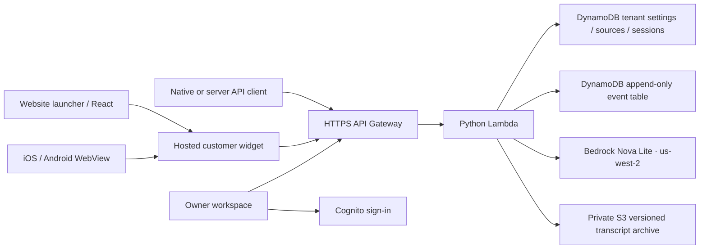

# OrderProof architecture

A single Python Lambda serves the static application and JSON API behind an HTTPS HTTP API Gateway. Cognito access JWTs protect `/api/*`; the backend independently requires an access-token claim and checks tenant ownership. Customer endpoints use a random per-conversation bearer token, stored only as a SHA-256 hash server-side. The public site identifier contains no secret.

## Knowledge and answers

Businesses paste text, upload text PDFs, or import one public HTTPS page on a configured domain. URL imports validate every redirect, reject private/reserved addresses, pin the resolved IP while verifying TLS hostname, and bound response size and time. Sources require explicit approval. Retrieval ranks tenant-only document passages lexically, then supplies up to three passages and recent history to Bedrock. Structured answers must reference provided source IDs. This reduces unsupported answers but does not mathematically establish factual entailment; human review and real model evaluations are still required. Missing passages and Bedrock failures produce explicit non-generated handoff suggestions.

## Events and integrity

A DynamoDB transaction atomically appends an event, updates conversation version/sequence/digest, records the request ID, and updates the tenant inbox index. Concurrent writes use optimistic locking. Request IDs make exact retries idempotent. A late model response is discarded if a newer turn or human handoff has changed the conversation. Closing reserves the final event and makes it read-only. Failed archive attempts can be retried from the inbox.

The separate events table has no UpdateItem/DeleteItem permission in the application role. This is an application-level append-only policy, not protection from an AWS administrator. Each event includes its predecessor digest; closed transcripts are uploaded to private S3 with checksum validation, versioning, default 30-day governance retention, AES256 server encryption, public-access blocking, and a TLS-only bucket policy. Verification fetches the exact archived version and compares its digest to the current transcript. Retention bypass is not granted to the Lambda role. Privileged administrators may override governance retention; absolute immutability is not claimed.

Chat records are scheduled for DynamoDB TTL deletion after 90 days. Closed S3 transcripts expire 90 days after archive creation; noncurrent versions expire after one further day. Actual deletion is asynchronous. Archive retention can extend beyond the chat’s 90-day access period. The business identity in the transcript is snapshotted at chat creation so later renaming does not invalidate records. Customer names are self-reported.

## Integration boundaries

The website SDK uses a closed shadow root and external CSS for the launcher, plus an isolated iframe. Frame embedding is limited by each business's configured origins. Custom API clients are supported for native/server use; a browser custom client requires a same-origin backend proxy. Mobile WebView samples use the same hosted page; no native app binaries have been produced. Polling pauses in background tabs and after customer conversation closure.

## Cost and current scope

On-demand Lambda/DynamoDB, no NAT gateway, no always-on vector database. Global AI attempts and chat starts are capped, while public read/static traffic is throttled rather than financially capped. See the cost evidence and operations document. One owner-operated human inbox per tenant; no voice calls or team role management. Stripe activation is deferred. Bedrock account quota presently blocks real generated answers; human support and record preservation were live-tested.

## Email readiness and model diagnostics

The owner usage endpoint reports the last real model attempt as available, unavailable, or untested. Model transport timeouts now produce the same explicit fallback while preserving the customer message. This indicator is not a claim that future model responses are correct.

Transactional notice code is disabled until SES sender configuration exists, and also requires each workspace owner to opt in. Recipient addresses come from verified Cognito account attributes. CloudFormation attaches narrowly scoped mail and directory permissions only when the SES branch is enabled. Public email previews contain fictional data and use a separate restrictive CSP permitting their trusted inline email styles; the main app CSP remains unchanged.
